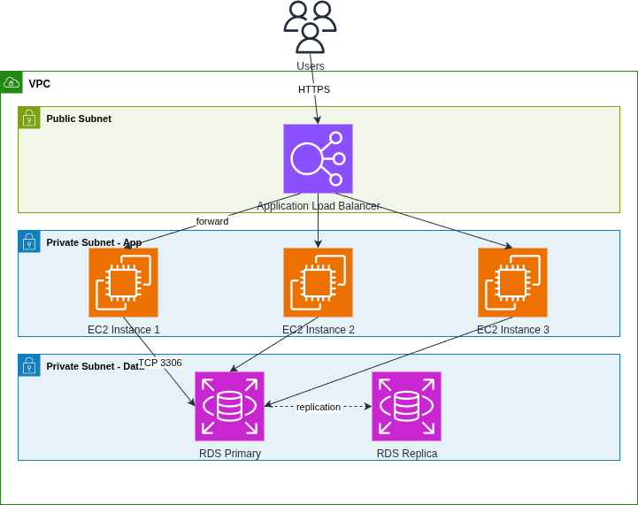
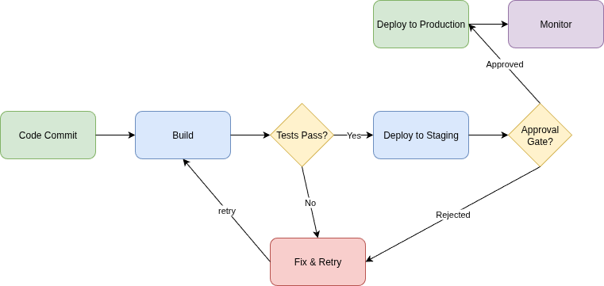
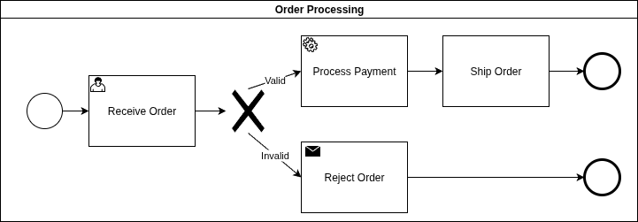
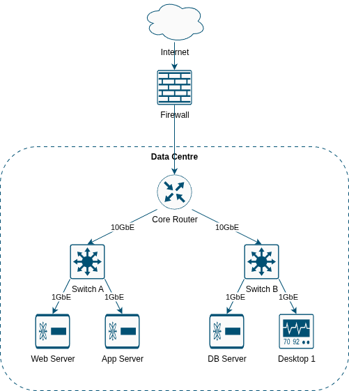
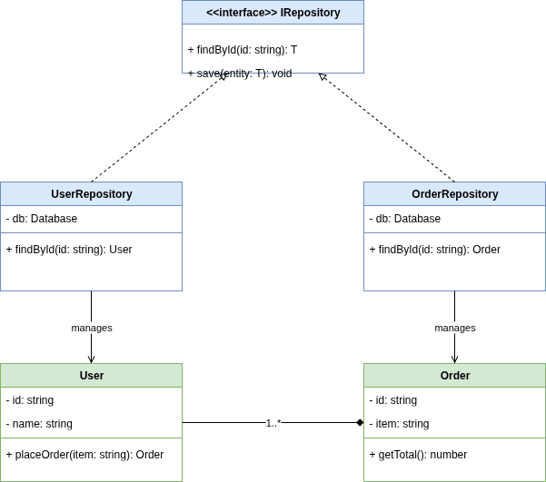

# Using the `/drawio` Skill

The `/drawio` skill generates draw.io diagrams from natural language prompts, reference images, and architecture documentation files. It supports multiple notation libraries (AWS, BPMN, Cisco, UML, and more) and produces `.drawio` files you can open directly in draw.io or diagrams.net.

**How to invoke:** Type `/drawio` followed by a description of the diagram you want.

```
/drawio <your diagram description>
/drawio <point to an image to recreate>
/drawio <point to a markdown file for batch generation>
```

The skill will:
1. Interpret your prompt and select the appropriate notation
2. Generate a structured diagram model with nodes, edges, and containers
3. Validate the XML output
4. Export a `.drawio` file you can open and edit

Diagrams are stored in **projects** with full version history, so you can revisit, update, and extend your diagrams across sessions.

---

## Example 1: AWS Three-Tier Architecture

**What to ask:**
```
/drawio Draw an AWS three-tier architecture with a VPC containing an ALB
in a public subnet, three EC2 instances in a private app subnet, and an
RDS primary with read replica in a private data subnet
```

**What gets generated:**

A layered AWS infrastructure diagram showing a VPC with three subnets (public, private app, private data). Traffic flows from users through the Application Load Balancer, which distributes requests across three EC2 instances. The instances connect to an RDS primary database that replicates to a read replica.



**Key details:**
- **Notation:** `aws` — uses `mxgraph.aws4` stencils (ELB, EC2, RDS icons)
- **Diagram type:** `infrastructure`
- **Features shown:** VPC/subnet containers, load-balanced fan-out edges, dashed replication link

---

## Example 2: CI/CD Pipeline Flowchart

**What to ask:**
```
/drawio Create a CI/CD pipeline flowchart: Code Commit leads to Build,
then a Tests Pass decision — if yes, deploy to staging, then an approval
gate — if approved, deploy to production and monitor. Failed tests and
rejected deployments loop back to fix and retry.
```

**What gets generated:**

A colour-coded flowchart with the happy path flowing left-to-right. Decision diamonds branch to a "Fix & Retry" node that loops back to the build step. Green nodes mark entry/exit points, blue for processing steps, yellow for decisions, and red for the failure path.



**Key details:**
- **Notation:** `generic` — standard draw.io shapes (rounded rectangles, diamonds)
- **Diagram type:** `flowchart`
- **Features shown:** Decision branching, feedback loops, colour coding by purpose

---

## Example 3: BPMN Order Processing Workflow

**What to ask:**
```
/drawio Create a BPMN order processing workflow in a pool: start event,
receive order (user task), validate with exclusive gateway — valid orders
go to process payment (service task) then ship order then end event,
invalid orders go to reject order (send task) then a separate end event
```

**What gets generated:**

A BPMN 2.0 process diagram inside a swimlane pool. The flow uses proper BPMN shapes: circle start/end events, rounded-rectangle tasks with role markers (user, service, send), and a diamond exclusive gateway for the validation decision.



**Key details:**
- **Notation:** `bpmn` — uses `mxgraph.bpmn` stencils (events, tasks, gateways)
- **Diagram type:** `flowchart`
- **Features shown:** Swimlane pool, typed task markers, exclusive gateway with labelled branches

---

## Example 4: Cisco Network Topology

**What to ask:**
```
/drawio Draw a Cisco network diagram: Internet connects to a firewall,
then a core router inside a data centre container. The router connects to
two multilayer switches, each connecting to servers and desktops. Label
links with speeds.
```

**What gets generated:**

A top-down network topology using official Cisco icons. The Internet cloud sits outside the data centre container. Traffic flows through the firewall to a core router, which fans out to two distribution switches. Each switch connects to endpoint devices with link speed labels.



**Key details:**
- **Notation:** `cisco` — uses `mxgraph.cisco19` stencils (router, switch, firewall, server, desktop)
- **Diagram type:** `infrastructure`
- **Features shown:** Dashed container for network zone, Cisco teal colour scheme, link speed labels

---

## Example 5: UML Class Diagram

**What to ask:**
```
/drawio Create a UML class diagram with an IRepository interface that has
findById and save methods. UserRepository and OrderRepository implement it.
User and Order are entity classes with fields and methods. User composes
Orders.
```

**What gets generated:**

A UML 2.x class diagram with five classes arranged in an inheritance hierarchy. The interface sits at the top with dashed realisation arrows from the two repository classes. Entity classes sit below with association and composition relationships.



**Key details:**
- **Notation:** `uml` — native draw.io UML shapes (swimlane classes, text compartments)
- **Diagram type:** `generic`
- **Features shown:** Interface realisation (dashed block arrows), composition (filled diamond), class compartments with fields/methods

---

## Example 6: Batch Generation from a Markdown Document

The skill can read a markdown architecture document and generate multiple diagrams from it in a single session. Point `/drawio` at a `.md` file and tell it what you want.

**What to ask:**
```
/drawio using @docs/architecture.md generate UML use case diagrams
for each scenario described in the document
```

Or with more specific instructions:
```
/drawio generate all infrastructure diagrams from ./docs/cloud-design.md
using Azure notation
```

```
/drawio from @docs/platform-spec.md create a diagram per section — use
Cisco notation for the networking sections and AWS for the compute sections
```

**What happens:**

1. The skill reads the markdown file
2. It analyses the content and produces a **diagram plan** — a table listing each diagram it will generate (name, notation, type, description)
3. It presents the plan for your confirmation — you can add, remove, or modify entries before proceeding
4. It generates each diagram sequentially, all stored in the same project
5. It shows a summary table with export paths and any warnings

**Key details:**
- **Limit:** Up to 10 diagrams per batch by default — the skill will ask you to prioritise if the document suggests more
- **Notation inference:** The skill auto-detects notation from document content (e.g. mentions of EC2/S3 → `aws`, Hyper-V/Azure Arc → `azure`), or you can specify it explicitly
- **Project grouping:** All diagrams from the same file are stored in a shared project (named after the file), making them easy to find and update later
- **Re-running:** If you update the document and re-run the same batch, existing diagrams are versioned up rather than duplicated

---

## Working with Existing Projects

Diagrams are stored in projects. You can list, update, and revise diagrams from previous sessions.

### Listing existing diagrams

```
/drawio list all diagrams in the cloud-design project
```

### Revising an existing diagram

```
/drawio update the "api-gateway" diagram in cloud-design project —
add a Lambda authoriser between the API Gateway and the backend services
```

The skill will load the latest version, apply the changes, and save a new version (v2, v3, etc.). The original versions are preserved for rollback.

### Continuing work on a project

```
/drawio add a new "monitoring-stack" diagram to the cloud-design project
showing CloudWatch, SNS notifications, and a PagerDuty integration
```

New diagrams are added to the existing project alongside previous ones.

### Re-generating from an updated document

```
/drawio regenerate diagrams from @docs/architecture.md — the document
has been updated with a new "Disaster Recovery" section
```

The skill detects that the project already exists and uses upsert: unchanged diagrams are versioned up, and new sections produce new diagram models.

---

## Supported Notations

| Notation | Stencil Library | Best For |
|----------|----------------|----------|
| `generic` | Built-in draw.io | Flowcharts, org charts, general diagrams |
| `aws` | `mxgraph.aws4` | AWS architecture diagrams |
| `azure` | `azure2` SVGs | Azure architecture diagrams |
| `gcp` | `mxgraph.gcp2` | Google Cloud architecture diagrams |
| `cisco` | `mxgraph.cisco19` | Network topology diagrams |
| `archimate` | `mxgraph.archimate3` | Enterprise architecture (ArchiMate 3.x) |
| `uml` | Native UML shapes | Class, sequence, component, activity diagrams |
| `bpmn` | `mxgraph.bpmn` | Business process workflows |

You don't need to specify the notation explicitly — the skill infers it from your prompt. Mentioning "AWS", "Cisco", "BPMN", or "UML" in your description is enough.
